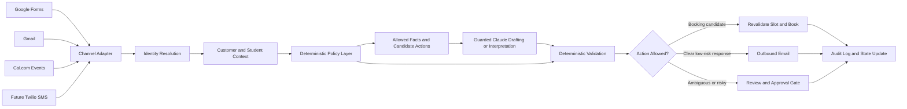

# Architecture

The private system is designed around a simple rule: language models may help
with language, but deterministic software owns authority.

## High-Level Flow

## Core Components

### Channel Adapter

Each input channel is normalized into a common internal message shape. This
keeps the receptionist from becoming tied to one provider or one lead source.
Google Forms and Gmail are the primary current paths. Cal.com webhooks and SMS
fit the same pattern as the platform grows.

### Identity Resolution

The system distinguishes between unknown leads, known contacts, students,
parents, guardians, billing contacts, and owner-approved relationships. Unknown
or conflicting identity does not get promoted automatically.

### Customer and Student Context

Business facts are separated into categories such as public service facts,
private customer facts, booking facts, and lesson-credit facts. This prevents a
drafting model from blending unverified information into customer-facing copy.

### Deterministic Policy Layer

Policy code decides what actions are allowed. Examples include whether an
inbound reply can select a previously offered slot, whether a customer needs
human review, whether booking is enabled, and whether owner approval is
required.

### Guarded Claude Drafting

The LLM receives bounded tasks, such as interpreting a scheduling reply or
drafting warmer wording from approved facts. It does not receive authority to
invent availability, decide identity, change credits, or execute bookings.

### Review and Approval Gate

Ambiguous messages, unsupported requests, risky account changes, and uncertain
identity route to a review queue. The owner can approve, reject, or manually
handle the item.

### Side-Effect Adapters

Outbound email and booking actions happen only after validation. Each external
action is recorded so retries can be reconciled instead of repeated blindly.

## Why the LLM Is Not Trusted With Direct Execution

Scheduling is customer-impacting. A model can misunderstand vague language,
confuse similar contacts, overgeneralize from context, or produce confident
wording for facts it does not actually know. The private system treats the LLM
as a language component inside a larger control system.

This architecture gives the system the benefits of AI communication while
keeping the irreversible parts under deterministic application control.
